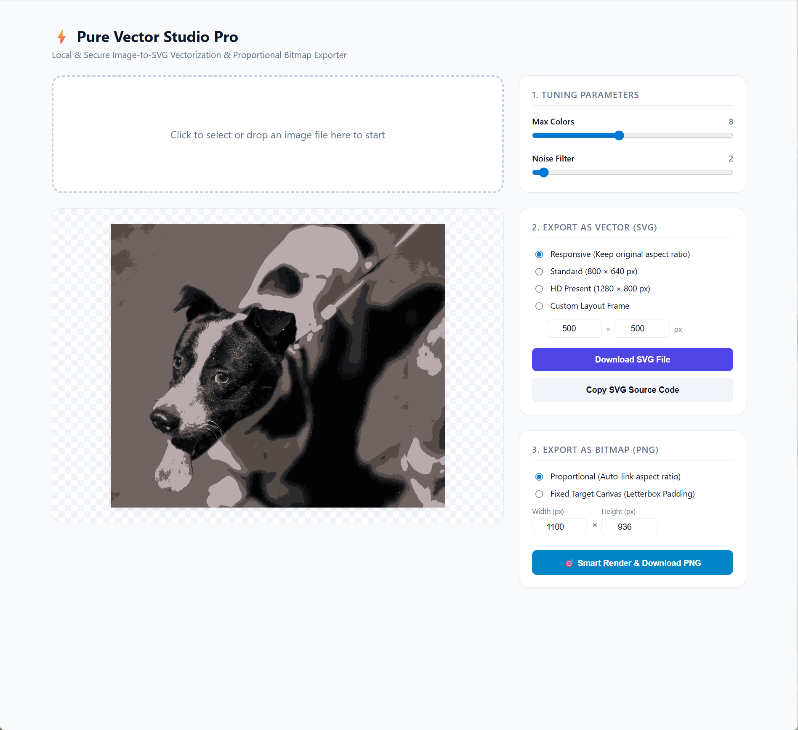

# ⚡ Pure Vector Studio Pro

> **Available in / 语言版本 / 利用可能な言語 / Idiomas disponibles:**
> [🇺🇸 English](#-english) · [🇨🇳 简体中文](#-简体中文) · [🇯🇵 日本語](#-日本語) · [🇪🇸 Español](#-español)

---


<a id="-english"></a>

# ⚡ Pure Vector Studio Pro

A powerful, 100% local, and secure browser extension built for designer-developer workflows. Convert any raster image into precision Scalable Vector Graphics (SVG) nodes instantly, and export tailored Bitmaps (PNG) with intelligent responsive layout engines.

## 🌟 Key Features

### 1. High-Fidelity Local Vectorization
* **Zero Server Overhead:** Built natively on mathematical curve-tracing algorithms. Every conversion runs 100% inside your sandbox environment—no images ever leave your local machine.
* **Granular Micro-Tuning:** Dynamic live-sliders allow you to tune the `Max Colors` palette restriction and adjust the `Noise Filter` threshold to output pristine mathematical vectors.

### 2. Versatile Vector SVG Outputs
* **Flexible Dimension Framing:** Select from dynamic, responsive viewport dimensions or enforce strict presentational configurations (e.g., standard 800×640 px or 1280×800 px).
* **Developer Ready:** Instantly clone raw XML markup nodes onto your system clipboard with a single click—perfect for hot-dropping directly into frontend code.

### 3. Smart Proportional Bitmap (PNG) Exporter 🎯
* **Aspect-Ratio Linkage:** Input a desired value for either the width or height; the layout controller will instantly crunch the image's original proportions and auto-fill the neighboring frame bounds.
* **Letterbox Padding Engine:** Need to hit a strict grid limit (e.g., 800×800 e-commerce banner)? Switch to the *Fixed Target Canvas* mode to center-render the vector asset perfectly while rendering empty space as a pristine transparent background. No stretching, no cropping.

### 4. High-End Studio Canvas UI
* Discarding generic checkerboards for a sleek, modern workstation workspace. The preview canvas is lined with ultra-faint micro-grid scaling boundaries and layered with a subtle, geometric ambient blur to emphasize vector contrast without color pollution.

## 🛠️ Installation Guide

As this studio handles advanced operations securely in your browser context, install it locally via Developer Mode:

1. **Clone or Download** this repository onto your workstation.
2. Launch Google Chrome and navigate to the Extensions management terminal: `chrome://extensions/`.
3. In the top-right corner, switch the toggle to activate **"Developer mode"**.
4. In the top-left, click on the **"Load unpacked"** button.
5. Highlight and select the source directory containing your project configuration files (`manifest.json`, `index.html`, etc.).
6. Click the extension icon pinned in your toolbar and start creating!

## 📁 Repository Structure

```text
├── manifest.json         # Extension registry and environment permissions
├── index.html            # Studio application frame & UI layout
├── index.js              # Vector tracking pipelines & canvas rasterization engines
└── libs/
    └── imagetracer_v1.2.6.js # Core mathematical curve-tracing library
```

## 🚀 How to Use

* **Import:** Simply drag and drop any image asset into the primary dropzone, or click to open your device file manager.
* **Optimize:** Tweak the sliders under **1. Tuning Parameters** to watch your vector structure rebuild itself live in the canvas viewer.
* **Download or Copy:** Hit **Download SVG** or **Copy SVG Source Code** to grab standard vector data.
* **Bitmap Export:** Toggle your layout strategy under **3. Export as Bitmap**, define your canvas bounds, and click **Smart Render** to extract perfectly framed PNGs.

## 🛡️ Privacy & Security

This studio treats data as sacred. It requests zero network permissions, requires no authentication, and writes absolutely nothing to remote clouds. Your proprietary layout geometries and corporate graphics remain entirely local to your environment.

## 📄 License

This software utility is distributed under the MIT License. Feel free to fork, adapt, or build upon this tool for commercial or private design pipelines.

---

<a id="-简体中文"></a>

# ⚡ Pure Vector Studio Pro

一款专为设计师与开发者协作打造的高性能、完全本地化、安全可靠的浏览器扩展。能够将任意位图即时转换为高精度的 SVG 矢量节点，并通过智能的响应式布局引擎导出量身定制的 PNG 位图。

## 🌟 核心功能

### 1. 高保真本地矢量化
* **零服务器开销：** 基于数学曲线追踪算法原生构建。所有转换过程 100% 在沙箱环境中完成，图像数据不会离开您的本机。
* **精细化实时调参：** 通过动态的实时滑块，可调整 `Max Colors`（最大颜色数）的调色板限制以及 `Noise Filter`（噪点过滤）阈值，输出纯净的数学矢量。

### 2. 灵活多样的 SVG 矢量输出
* **灵活的画布尺寸：** 既可使用自适应响应式视口尺寸，也可以强制使用固定的预设尺寸（例如标准的 800×640 px 或 1280×800 px）。
* **开发者友好：** 一键即可将原始 XML 节点复制到系统剪贴板，可直接粘贴到前端代码中使用。

### 3. 智能等比 PNG 位图导出 🎯
* **比例自动联动：** 只需输入宽度或高度的任一数值，布局引擎便会立即按原图比例自动计算并补全相邻边的尺寸。
* **信箱式留白引擎：** 需要严格对齐固定画布（例如 800×800 的电商 Banner）？切换到 *固定目标画布* 模式，矢量资源将居中渲染，空白区域填充为纯净的透明背景。绝不拉伸、绝不裁切。

### 4. 高级工作台画布 UI
* 抛弃单调的棋盘格背景，采用现代简洁的工作站式画布。预览区配有极淡的微网格参考线，并叠加了细腻的几何环境光晕，在不干扰色彩的前提下凸显矢量对比度。

## 🛠️ 安装指南

由于本工具的所有高级运算均在浏览器沙箱内安全完成，请通过 Chrome 的「开发者模式」进行本地安装：

1. **克隆或下载** 本仓库到本地。
2. 启动 Google Chrome，进入扩展程序管理页：`chrome://extensions/`。
3. 打开页面右上角的开关，启用 **"开发者模式"**。
4. 点击左上角的 **"加载已解压的扩展程序"** 按钮。
5. 在弹出的目录选择框中，选中项目根目录（即包含 `manifest.json`、`index.html` 等文件的文件夹）。
6. 在浏览器工具栏中点击扩展图标，即可开始创作！

## 📁 仓库结构

```text
├── manifest.json         # 扩展注册信息与运行环境权限
├── index.html            # 工作台应用框架与 UI 布局
├── index.js              # 矢量追踪管线与画布光栅化引擎
└── libs/
    └── imagetracer_v1.2.6.js # 核心数学曲线追踪库
```

## 🚀 使用方法

* **导入：** 将任意图片直接拖入主投放区，或点击以打开本地文件管理器。
* **调参：** 拖动 **1. 调参面板** 中的滑块，画布中的矢量结构会实时重建。
* **下载或复制：** 点击 **下载 SVG** 或 **复制 SVG 源码**，即可获得标准矢量数据。
* **位图导出：** 在 **3. 导出位图** 中切换布局策略，设定画布尺寸后点击 **智能渲染**，即可得到完美构图的 PNG。

## 🛡️ 隐私与安全

本工具将数据视为最高机密。不申请任何网络权限、无需登录或注册，也不会向任何远端云服务写入任何数据。您的内部布局尺寸与商业素材完全保留在本地环境内，绝不外泄。

## 📄 许可证

本软件遵循 MIT 许可证发布。您可以自由地 Fork、修改或将其用于商业或个人的设计流程中。

---

<a id="-日本語"></a>

# ⚡ Pure Vector Studio Pro

デザイナーと開発者のワークフローのために作られた、強力かつ 100% ローカルで安全なブラウザ拡張機能です。あらゆるラスター画像を即座に高精度な SVG ベクターに変換し、スマートなレスポンシブレイアウトエンジンにより最適な PNG ビットマップを書き出せます。

## 🌟 主な機能

### 1. 高忠実度なローカルベクター化
* **サーバー負荷ゼロ：** 数学的な曲線トレースアルゴリズムをネイティブに実装。すべての変換は 100% サンドボックス内で実行され、画像がローカル環境から外部へ送信されることはありません。
* **きめ細やかなリアルタイム調整：** ダイナミックなライブスライダーにより、`Max Colors`（最大色数）のパレット制限と `Noise Filter`（ノイズ除去）の閾値を微調整し、純粋な数学ベクターを出力できます。

### 2. 多彩な SVG ベクター出力
* **柔軟なキャンバスサイズ：** レスポンシブなビューポート寸法と、厳格な固定寸法（例：標準の 800×640 px、1280×800 px）を切り替えて使用できます。
* **開発者に優しい：** ワンクリックで生の XML ノードをシステムクリップボードへコピー。フロントエンドのコードへそのまま貼り付けられます。

### 3. スマート等比 PNG ビットマップ出力 🎯
* **アスペクト比の自動連動：** 幅または高さのどちらかを入力すれば、レイアウトエンジンが即座に元画像のアスペクト比を計算し、もう一方の寸法を自動で補完します。
* **レターボックス・パディング機能：** 厳格なキャンバスサイズ（例：800×800 の E コマースバナー）に収めたい場合は、*Fixed Target Canvas* モードへ切り替えれば、ベクター素材が中央に配置され、余白は透明な背景でレンダリングされます。引き伸ばしやクロップは一切行いません。

### 4. ハイエンド・スタジオキャンバス UI

* 一般的なチェッカーボードを廃止し、洗練されたモダンなワークステーションを採用。プレビューキャンバスには極めて微細なマイクログリッドが引かれ、幾何学的なアンビエントぼかしが重ねられているため、色の邪魔をせずにベクターのコントラストを際立たせます。

## 🛠️ インストール方法

本スタジオはブラウザのサンドボックス内で高度な処理を安全に行うため、デベロッパーモードでローカルに読み込んでご利用ください：

1. 本リポジトリを **クローンまたはダウンロード** します。
2. Google Chrome を起動し、拡張機能管理ページ `chrome://extensions/` を開きます。
3. ページ右上にあるトグルをオンにして、**「デベロッパーモード」** を有効化します。
4. 左上の **「パッケージ化されていない拡張機能を読み込む」** ボタンをクリックします。
5. プロジェクトの設定ファイル（`manifest.json`、`index.html` など）が含まれるディレクトリを選択します。
6. ツールバーにピン留めされた拡張機能アイコンをクリックして、創作を始めましょう！

## 📁 リポジトリ構成

```text
├── manifest.json         # 拡張機能の登録情報と環境権限
├── index.html            # スタジオアプリのフレームと UI レイアウト
├── index.js              # ベクタートラッキングパイプラインとキャンバスラスタライズエンジン
└── libs/
    └── imagetracer_v1.2.6.js # コアの数学曲線トレースライブラリ
```

## 🚀 使い方

* **インポート：** メインのドロップゾーンに画像をドラッグ＆ドロップするか、クリックしてローカルファイル選択を開きます。
* **最適化：** **1. チューニング** のスライダーを動かすと、キャンバス上のベクター構造がリアルタイムに再構築されます。
* **ダウンロードまたはコピー：** **SVG をダウンロード** または **SVG ソースコードをコピー** をクリックして、標準ベクターデータを取得します。
* **ビットマップ出力：** **3. ビットマップにエクスポート** でレイアウト戦略を切り替え、キャンバスサイズを指定して **スマートレンダリング** をクリックすると、完璧にフレーミングされた PNG が書き出されます。

## 🛡️ プライバシーとセキュリティ

本スタジオはデータを最も神聖なものとして扱います。ネットワーク権限は一切要求せず、認証も不要、リモートのクラウドへ一切書き込みません。独自のレイアウト寸法や企業向けグラフィックは、常にローカル環境内に留まります。

## 📄 ライセンス

本ソフトウェアは MIT ライセンスの下で配布されています。商用・個人用のデザイン用途を問わず、自由にフォーク、改変、組み込みいただけます。

---

<a id="-español"></a>

# ⚡ Pure Vector Studio Pro

Una extensión de navegador potente, 100% local y segura, diseñada para flujos de trabajo de diseñadores y desarrolladores. Convierte cualquier imagen ráster en nodos SVG (Scalable Vector Graphics) de precisión al instante y exporta mapas de bits (PNG) personalizados con un motor de diseño adaptable inteligente.

## 🌟 Características principales

### 1. Vectorización local de alta fidelidad
* **Sin carga en el servidor:** Construida de forma nativa sobre algoritmos matemáticos de trazado de curvas. Cada conversión se ejecuta 100% dentro de tu entorno sandbox: ninguna imagen sale de tu equipo local.
* **Ajuste fino en tiempo real:** Deslizadores dinámicos en vivo que te permiten ajustar la restricción de paleta `Max Colors` (colores máximos) y el umbral `Noise Filter` (filtro de ruido) para obtener vectores matemáticos impecables.

### 2. Salidas SVG vectoriales versátiles
* **Dimensiones de lienzo flexibles:** Elige entre dimensiones de viewport dinámicas y adaptables, o aplica configuraciones de presentación estrictas (p. ej., 800×640 px o 1280×800 px).
* **Listo para desarrolladores:** Copia al instante el marcado XML en bruto al portapapeles del sistema con un solo clic: perfecto para pegarlo directamente en el código del frontend.

### 3. Exportador inteligente de PNG en mapa de bits 🎯
* **Vinculación por relación de aspecto:** Introduce el valor deseado para el ancho o el alto; el controlador de diseño calculará al instante las proporciones originales de la imagen y completará automáticamente el lado contiguo.
* **Motor de relleno tipo letterbox:** ¿Necesitas ajustarte a un límite de cuadrícula estricto (p. ej., banner de e-commerce de 800×800)? Cambia al modo *Fixed Target Canvas* (lienzo objetivo fijo) para centrar el recurso vectorial a la perfección, rellenando el espacio vacío con un fondo transparente impecable. Sin estiramientos, sin recortes.

### 4. Interfaz de lienzo de estudio de alta gama
* Sustituye los clásicos tableros de damas por un espacio de trabajo moderno y elegante. El lienzo de previsualización está enmarcado por microcuadrículas apenas perceptibles y una sutil borrosidad ambiental geométrica que enfatiza el contraste vectorial sin contaminar el color.

## 🛠️ Guía de instalación

Como este estudio realiza operaciones avanzadas de forma segura en el contexto del navegador, instálalo localmente mediante el Modo Desarrollador:

1. **Clona o descarga** este repositorio en tu equipo.
2. Abre Google Chrome y navega a la terminal de gestión de extensiones: `chrome://extensions/`.
3. En la esquina superior derecha, activa el interruptor para habilitar el **"Modo desarrollador"**.
4. En la esquina superior izquierda, haz clic en el botón **"Cargar extensión descomprimida"**.
5. Selecciona el directorio raíz del proyecto (la carpeta que contiene `manifest.json`, `index.html`, etc.).
6. ¡Haz clic en el icono de la extensión fijado en la barra de herramientas y empieza a crear!

## 📁 Estructura del repositorio

```text
├── manifest.json         # Registro de la extensión y permisos del entorno
├── index.html            # Marco de la aplicación Studio y diseño de la UI
├── index.js              # Canalizaciones de seguimiento vectorial y motores de rasterización del lienzo
└── libs/
    └── imagetracer_v1.2.6.js # Biblioteca principal de trazado de curvas matemáticas
```

## 🚀 Cómo usar

* **Importar:** Simplemente arrastra y suelta cualquier imagen en la zona principal, o haz clic para abrir el selector de archivos de tu dispositivo.
* **Optimizar:** Ajusta los controles deslizantes en **1. Parámetros de ajuste** y observa cómo la estructura vectorial se reconstruye en vivo dentro del visor.
* **Descargar o copiar:** Pulsa **Descargar SVG** o **Copiar código fuente SVG** para obtener los datos vectoriales estándar.
* **Exportar como mapa de bits:** Cambia la estrategia de diseño en **3. Exportar como mapa de bits**, define el tamaño del lienzo y haz clic en **Renderizado inteligente** para extraer PNGs perfectamente encuadrados.

## 🛡️ Privacidad y seguridad

Este estudio trata los datos como algo sagrado. No solicita ningún permiso de red, no requiere autenticación y no escribe absolutamente nada en la nube remota. Tus geometrías de diseño propietarias y tus gráficos corporativos permanecen por completo en tu entorno local.

## 📄 Licencia

Esta herramienta de software se distribuye bajo la Licencia MIT. Siéntete libre de hacer fork, adaptar o construir sobre ella tanto en flujos de diseño comerciales como privados.

---

